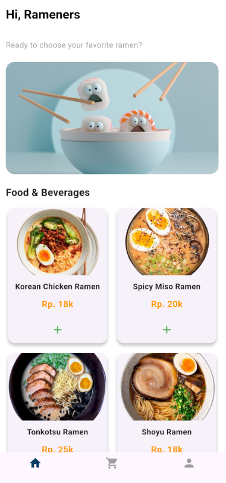
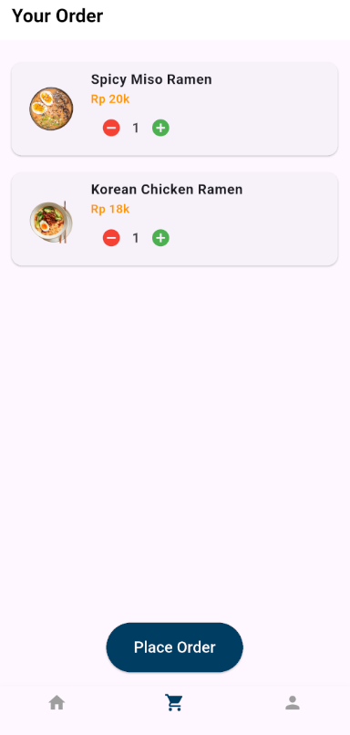

# 🍜 RamenKuy — Final Project for Mobile Programming Course

**RamenKuy** is a mobile food ordering application developed as the final project for the Mobile Programming course. Built using **Dart** and **Flutter**, this app allows users to browse a ramen menu, place food orders, and have their orders stored and managed via **Firebase**.

This project represents a culmination of what we've learned during the semester, integrating UI/UX principles, state management, and backend interaction using cloud services.

## 👋 Preview

## 📱 Features

- 🧾 **Order Menu** — Browse a selection of ramen dishes with prices and details.
- 🛒 **Place an Order** — Add items to cart and confirm orders.
- ☁️ **Firebase Integration** — Orders are stored in real-time using **Firebase Realtime Database** or **Cloud Firestore**.
- 🎨 **User Interface** — Clean, minimalistic, and responsive design built with Flutter.

## 🛠 Tech Stack

- **Dart** — Programming language
- **Flutter** — Framework for building cross-platform mobile applications
- **Firebase** — Cloud backend (authentication, database, and/or storage)

